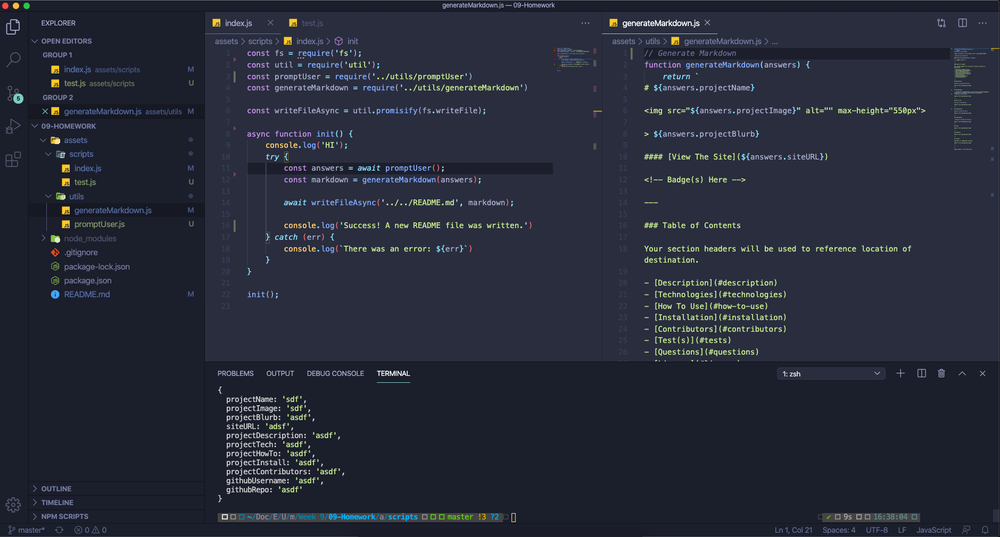

# README Generator

> This is a short project blurb

#### [View The Site](https://google.com)

<!-- Badge(s) Here -->

---

### Table of Contents

Your section headers will be used to reference location of destination.

- [Description](#description)
- [Technologies](#technologies)
- [How To Use](#how-to-use)
- [Installation](#installation)
- [Contributors](#contributors)
- [Test(s)](#tests)
- [Questions](#questions)
- [License](#license)

---

## Description

This is the description.

[Back To The Top](#project-name)

---

## Technologies

- Javascript, HTML & CSS

[Back To The Top](#project-name)

---

## How To Use

Click the link

[Back To The Top](#project-name)

---

## Installation

CLick the link

#### [View The Site](https://google.com)

[Back To The Top](#project-name)

---

## Contributors

- Nate Valline

[Back To The Top](#project-name)

---

## Tests

[Back To The Top](#project-name)

---

## Questions

[Back To The Top](#project-name)

---

## License

Copyright (c) [2020][nate valline]

[Back To The Top](#project-name)

---
    